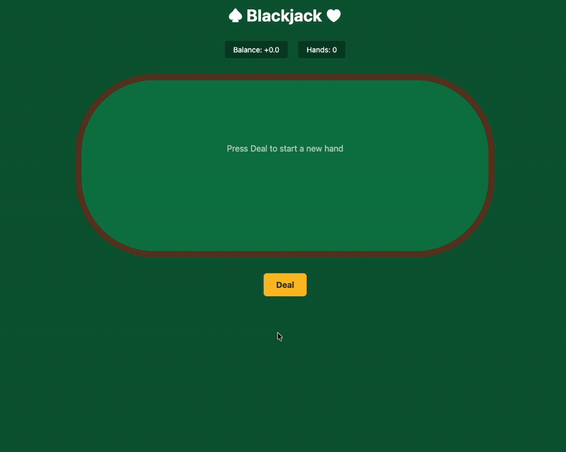

# llm21

A benchmark for evaluating how well large language models play optimal blackjack strategy.



## Results

| Model | Accuracy | Balance (1000 hands) |
|-------|----------|----------------------|
| Gemini 3 Flash | 98.2% | +19.50 |
| GPT-5.2 | 89.2% | +25.00 |
| Claude Opus 4.5 | 89.2% | +12.50 |
| Claude Sonnet 4.5 | 83.2% | -13.50 |
| GPT-4o Mini | 74.0% | -63.00 |

### Error Patterns

Each model has a distinct "personality" in how it fails:

- **GPT-4o Mini**: Over-aggressive - doubles when it shouldn't
- **Claude Sonnet 4.5**: Confused aggressive - doubles wrong, sometimes hits wrong
- **Claude Opus 4.5**: Conservative - doesn't double enough, hits too much
- **GPT-5.2**: Defeatist - surrenders too early
- **Gemini 3 Flash**: Near-perfect - only weakness is over-surrendering 14 vs high cards

## Installation

Requires Python 3.14+ and [uv](https://docs.astral.sh/uv/).

```bash
git clone https://github.com/thomasgtaylor/llm21.git
cd llm21
uv sync
```

## Configuration

Copy the environment template and add your API keys:

```bash
cp .env.template .env
```

Edit `.env` to set your model and API keys:

```bash
MODEL=openai:gpt-4o-mini-2024-07-18

# Add your API keys
OPENAI_API_KEY=sk-...
ANTHROPIC_API_KEY=sk-ant-...
GOOGLE_API_KEY=...
```

### Supported Models

- `openai:<model-id>` - OpenAI models (requires `OPENAI_API_KEY`)
- `anthropic:<model-id>` - Anthropic models (requires `ANTHROPIC_API_KEY`)
- `google_genai:<model-id>` - Google models (requires `GOOGLE_API_KEY`)

## Usage

### Run the Benchmark

```bash
# Run 1000 hands with all strategies
uv run python benchmark.py -n 1000

# Run with specific strategies
uv run python benchmark.py -n 1000 -s optimal llm

# Run with custom output file
uv run python benchmark.py -n 1000 -o results.csv

# Resume from a specific hand index
uv run python benchmark.py -n 500 --start 500
```

### Generate Visualization Dashboard

```bash
uv run python visualize.py
open dashboard.html
```

### Run the Web UI

```bash
uv run uvicorn api:app --reload
```

## House Rules

The benchmark uses standard casino rules:

- 6-deck shoe
- Dealer stands on soft 17 (S17)
- Blackjack pays 3:2
- Double down allowed on any two cards
- Double after split allowed (DAS)
- Split any two cards of equal value (10-J-Q-K all match)
- No re-splitting
- Only one card dealt to split aces (no hitting allowed)
- 21 on split aces is not blackjack (pays 1:1, not 3:2)
- Late surrender allowed (first two cards only, not after split)
- Dealer peeks for blackjack

### Scoring

- Win: +1 unit
- Loss: -1 unit
- Push: 0
- Blackjack: +1.5 units
- Surrender: -0.5 units
- Doubled hands: 2x the result

## How It Works

1. Each hand is seeded for reproducibility - the same seed produces the same cards
2. The LLM receives the player's hand and dealer's upcard
3. The LLM decides: hit, stand, double, split, or surrender
4. Decisions are compared against mathematically optimal basic strategy
5. Results are logged to CSV for analysis

## Project Structure

```
llm21/
├── benchmark.py      # Main benchmark runner
├── blackjack.py      # Game engine
├── strategy.py       # Optimal basic strategy tables
├── llm.py            # LLM integration
├── visualize.py      # Dashboard generator
├── api.py            # Web UI server
├── benchmarks/       # Benchmark results by provider
│   ├── anthropic/
│   ├── google/
│   └── openai/
└── templates/        # Web UI templates
```

## License

MIT
